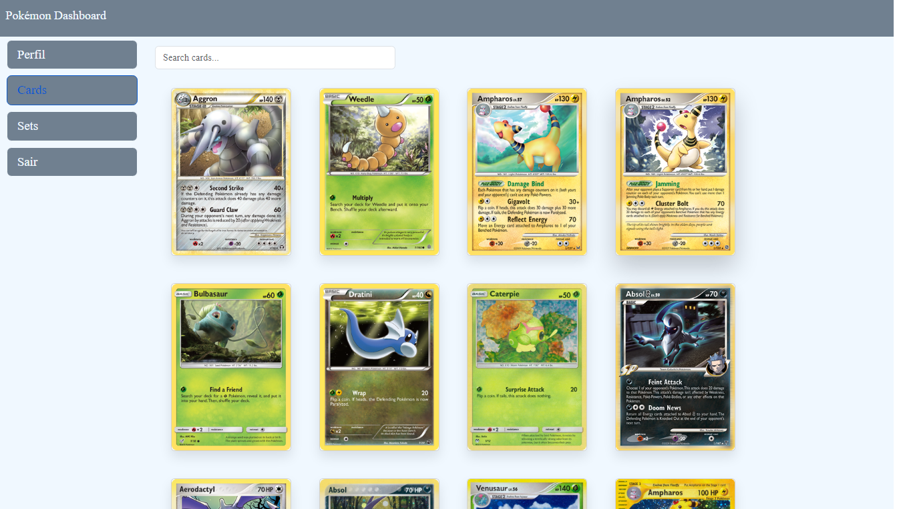
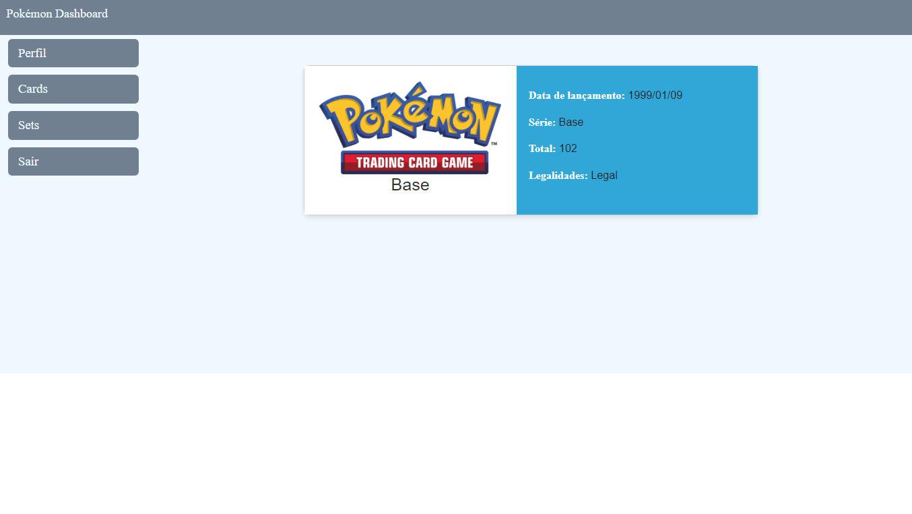

# Pokémon Dashboard

Pokémon Dashboard é uma Single Page Application (SPA) construída com Angular 18, que consome a API Pokémon TCG para exibir dados sobre cards e sets de Pokémon. A aplicação apresenta um layout de dashboard com cabeçalho e menu lateral fixos, e contém páginas de listagem e detalhes dos cards e sets. A interface é responsiva e estilizada com Bootstrap, utilizando CSS3 e SASS/SCSS.


## Configuração do Ambiente de Desenvolvimento

Para executar este projeto localmente, siga estas etapas:

1. Certifique-se de ter o Node.js versão 20 e o Angular CLI versão 18 estão instalados em seu ambiente de desenvolvimento.
2. Clone este repositório em sua máquina local.
3. No diretório raiz do projeto, execute o seguinte comando para instalar as dependências:

```bash
npm install
```

4. Após a instalação das dependências, você pode iniciar o servidor de desenvolvimento com o seguinte comando:

```bash
npm start
```

5. O aplicativo estará disponível em `http://localhost:4200/` por padrão. Você pode acessar este URL em seu navegador para visualizar o aplicativo.


## Funcionalidades

O aplicativo possui as seguintes funcionalidades:

1. **Lista de Cards**: Exibe uma lista de cards com seus nomes e imagens, com paginação infinita.

    

2. **Lista de Sets**: Exibe uma lista de sets com seus nomes e imagens, com paginação infinita.

    

3. **Detalhes do Card**: Permite visualizar os detalhes de cada card, incluindo Artista, Raridade, Descrição, Tipos, Fraquezas e Resistencias.

    

4. **Detalhes do Set**: Permite visualizar os detalhes de cada set, incluindo Data de lançamento, Série, Total e Legalidades.

    

5. **Busca de Cards e Sets**: Permite aos usuários buscar cards ou sets pelo nome.

6. **Autenticação**: Permite aos usuários fazer login.

    

7. **Perfil**: Permite aos usuários alterar informações de perfil.

    

## Estrutura do Projeto

O projeto está estruturado da seguinte forma:

- **src/app/models**: Contém as definições de modelos TypeScript utilizados para representar os dados dos cards e sets.
- **src/app/components**: Contém os componentes Angular utilizados no projeto, como `sidebar` e `header`.
- **src/app/pages**: Contém os componentes das páginas, como `card-list`, `set-list`, `card-detail`, `set-detail`, `login` e `profile`
- **src/app/services**: Contém os serviços Angular utilizados para buscar dados da API PokeTCG e gerenciar a autenticação.

## Dependências Externas

Este projeto utiliza as seguintes dependências externas:

- **Angular**: Framework TypeScript para construção de aplicações web.
- **RxJS**: Biblioteca para programação reativa em JavaScript.
- **HttpClientModule**: Módulo Angular para realizar requisições HTTP.
- **Bootstrap**: Framework de CSS para estilização responsiva.
